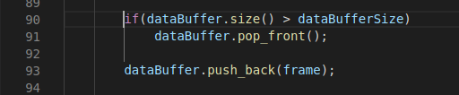
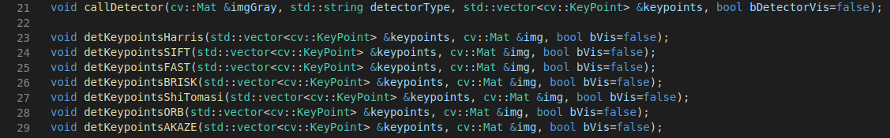
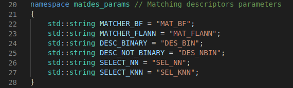
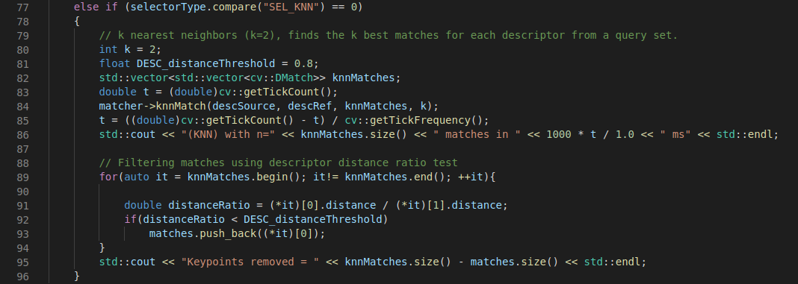

# SFND 2D Feature Tracking Writeup for Addressing all Ruberic Points

## Data Buffer
Used deque for O(1) time complexity operations instead of erasing from a vector

## Key Points Detectors
Implemented HARRIS, FAST, BRISK, ORB, AKAZE, and SIFT as shown below & 
the detector is called by `callDetector` function using a `string`

Key Points are removed using using rect.contains method to focus only
on the preceeding vehicle 

## Descriptors 
Implemented BRIEF, ORB, FREAK, AKAZE and SIFT descriptors

Created namespace for specifying the descriptor function params as BF, FLANN, KNN or NN etc

Implemented K-Nearest-Neighbor matching to implement the descriptor distance ratio test = 0.8

## Statistical Analysis 

Using stats script.py file to automate all the possible combination of detector and descriptor pairs.
Using KNN approach with (k=2) and filtering ratio = 0.8

***Matched descriptors are between first 2 frames***

| Approach no. | Detector + Descriptor | Total Keypoints | Total Matches | Time(ms) |
|------------- | ------------- | ------------- | ------------- | ------------- |
| 1 | Shi-Tomasi + BRISK | 1370 | 84 | 172.205 ms |
| 2 | Shi-Tomasi + BRIEF | 1370 | 96 | 45.8341 ms |
| 3 | Shi-Tomasi + ORB | 1370 | 87 | 49.5279 ms |
| 4 | Shi-Tomasi + FREAK | 1370 | 68 | 116.639 ms |
| 5 | Shi-Tomasi + SIFT | 1370 | 112 | 89.8264 ms |
| 6 | Harris + BRISK | 248 | 11 | 131.395 ms |
| 7 | Harris + BRIEF | 248 | 12 | 65.9843 ms |
| 8 | Harris + ORB | 248 | 11 | 54.3331 ms |
| 9 | FAST + BRISK | 5063 | 213 | 153.694 ms |
| 10 | FAST + BRIEF | 5063 | 229 | 32.8021 ms |
| 11 | FAST + ORB | 5063 | 218 | 31.1273 ms |
| 12 | BRISK + BRISK | 2757 | 138 | 288.656 ms |
| 13 | BRISK + FREAK | 2757 | 112 | 248.02 ms |
| 14 | ORB + BRISK | 500 | 60 | 1250.05 ms |
| 15 | ORB + BRIEF | 500 | 40 | 126.089 ms |
| 16 | ORB + SIFT | 500 | 67 | 190.433 ms |
| 17 | AKAZE + BRIEF | 1351 | 108 | 160.151 ms |
| 18 | AKAZE + ORB | 1351 | 102 | 178.226 ms |
| 19 | AKAZE + SIFT | 1351 | 134 | 230.366 ms |
| 20 | SIFT + FREAK | 1438 | 58 | 489.327 ms |
| 21 | SIFT + SIFT | 1438 | 82 | 382.408 ms |

### Top three detectors 
| Approach no. | Detector + Descriptor | Total Keypoints | Total Matches | Time(ms) |
|------------- | ------------- | ------------- | ------------- | ------------- |
| 1 | FAST + BRIEF | 5063 | 229 | 32.8021 ms |
| 2 | FAST + ORB | 5063 | 218 | 31.1273 ms |
| 3 | Shi-Tomasi + BRIEF | 1370 | 96 | 45.8341 ms |

